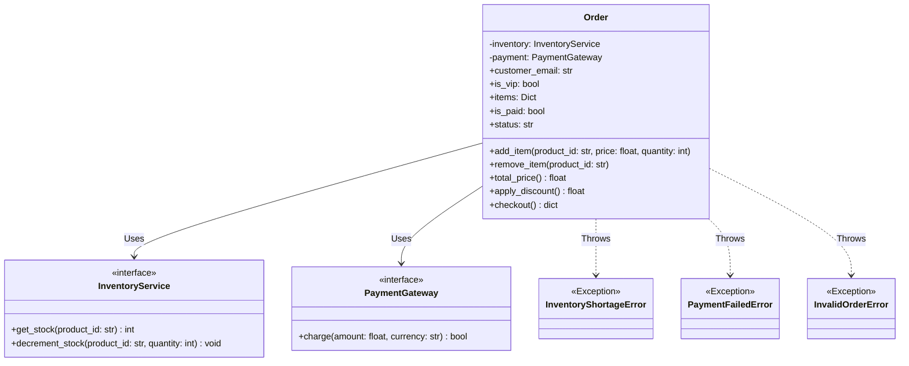
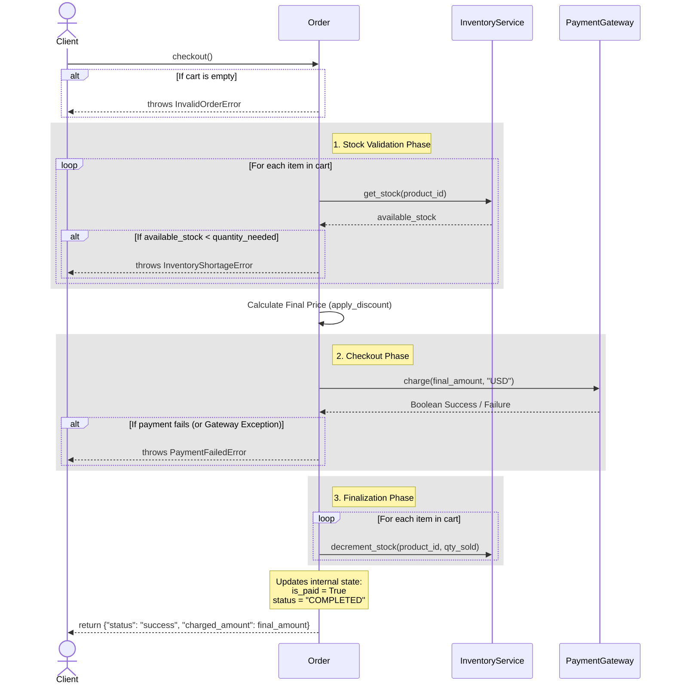

# E-commerce Order System

> **Note:** This project and code are built for the codelab: [Building with Google Antigravity](https://codelabs.developers.google.com/building-with-google-antigravity)

This repository contains the `order.py` file, which implements the core business logic for an e-commerce **Order** system. It is structured cleanly to separate concerns using Dependency Injection, making it highly testable and maintainable (aligning well with SOLID principles).

Here is a breakdown of its key components and architecture.

## 1. Code Logic Breakdown

### Custom Exceptions
We define three domain-specific exceptions: `InventoryShortageError`, `PaymentFailedError`, and `InvalidOrderError`. 
Using these custom exceptions makes it explicitly clear exactly *why* a checkout failed, rather than relying on generic errors like `ValueError` or `Exception`.

### External Service Interfaces
The `InventoryService` and `PaymentGateway` classes act as **interfaces**. 
Our `Order` class needs to talk to a database to check stock and a payment provider (like Stripe) to charge money. However, instead of hardcoding those connections right in the file, these classes define the "contract" (the methods) that the `Order` class expects to use. In a real application, you would create subclasses of these that actually connect to your database or Stripe, or you would pass in "Mock" versions when writing unit tests.

### The `Order` Class (Main Business Logic)
This is the heart of the file. It manages the state of a customer's shopping cart and handles the checkout process.

*   **Initialization (`__init__`)**: It uses **Dependency Injection**, taking an `inventory_service` and `payment_gateway` as arguments instead of creating them itself. This makes the code very easy to test.
*   **Cart Management**: `add_item()` validation prevents negative prices or quantities, and `remove_item()` deletes an item.
*   **Pricing Logic**: `apply_discount()` contains specific business rules for pricing (20% off for VIPs, 10% off for orders over $100, otherwise no discount).
*   **The Workflow: `checkout()`**: Orchestrates the purchase with a step-by-step transaction flow (Validation $\rightarrow$ Stock Check $\rightarrow$ Pricing $\rightarrow$ Payment $\rightarrow$ Finalize state).

---

## 2. Visualizing the Architecture

### Class Diagram
This diagram shows the relationship between the `Order` class, the external service interfaces it depends on, and the custom exceptions it can throw. 



### Checkout Sequence Diagram
Because the `checkout()` method is the most complex orchestration part of this class, this sequence diagram maps out exactly what happens step-by-step over time when you call it.



---

## 3. Unit Testing & Mocking

This project includes a comprehensive unit test suite in `test_order.py` that validates all business logic and edge cases.

### Running the Tests
To run the test suite locally, execute the following command in your terminal:
```bash
python -m unittest test_order.py -v
```

### What is Tested
The tests employ `unittest.mock.MagicMock` to simulate external services (`InventoryService` and `PaymentGateway`). This enables thorough testing of the `Order` class in isolation without making actual database queries or external API calls.

Key coverage areas include:
1. **Basic Cart Functions**: Validating the addition and removal of items, along with constraints on negative quantities or prices.
2. **Pricing Scenarios**: Testing the different branches of logic in the discount system (e.g., VIP savings, total threshold savings).
3. **The Checkout Workflow (Error Handling)**:
    * **Empty Cart**: Validation before initiating the checkout process.
    * **Inventory Shortage**: Mocking low stock scenarios to verify the application aborts and throws an `InventoryShortageError`.
    * **Payment Failures**: Simulating both declined payments and network exceptions to ensure a `PaymentFailedError` is raised.
    * **Complete Success State**: Verifying that upon successfully clearing the mocked stock and payment assertions, the internal stock logic and payment logic trigger appropriately, and the success response is returned.
